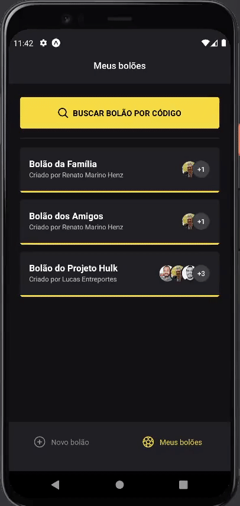

<h1 align="center"></h1>

# NLW Copa Mobile

## 💡 Project's Idea

This project was developed during the RocketSeat's Next Level Week - Copa event. It aims to provide a mobile application for placing bets on pools for the Fifa World Cup 2022.

## 🔍 Features

* 

<!-- <p align="center"></p> -->

## 💹 Extras

* 

## 🛠 Technologies

During the development of this project, the following techologies were used:

- [React Native](https://reactnative.dev/)
- [Native Base](https://nativebase.io/)
- [Expo](https://expo.dev/)
- [Google OAuth 2.0 Authentication](https://docs.expo.dev/guides/authentication/#google)
- [TypeScript](https://www.typescriptlang.org/)

## 💻 Project Configuration

### First, install the dependencies for the project

```bash
$ yarn
```

## 🌐 Settings Files Update

It's also required to create the *.env* file on the project's root folder, based on the sample file *.env.example* and update it with the required info.

```
# Google OAuth 2.0 client ID
CLIENT_ID=YOUR_CLIENT_ID
```

## ⏯️ Running

To run the project in a development environment, execute the following command on the root directory.

```bash
$ yarn start
```

### Documentation:
* [How to add Environment variables in a React Native project with TS](https://dev.to/bhatvikrant/how-to-add-environment-variables-in-a-react-native-project-with-ts-2ne5)

## 📄 License

This project is under the **MIT** license. For more information, access [LICENSE](./LICENSE).
